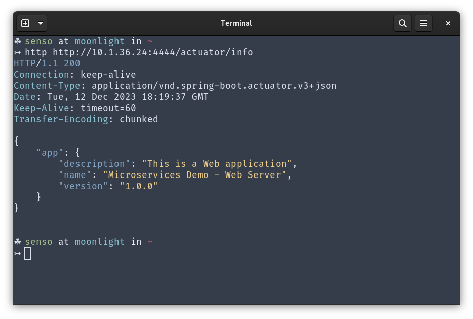

# Lab 6 Report

First of all, the config repository was forked in: https://github.com/sosensio/lab6-microservices-config-repo/

Then the following services were launched:


And the eureka dashboard shows both services:


The account configuration was modified to use port 3333 in commit with hash `079a34ebbf6822d815f712a08f8e5bf51df154ad` available [here](https://github.com/sosensio/lab6-microservices-config-repo/commit/079a34ebbf6822d815f712a08f8e5bf51df154ad).

At the moment we launch the second instance of the accounts service, Eureka dashboard shows both instances, one in port 2222 and the other in port 3333. 


First account service:


Second account service:


Furthermore, it displays the following warning:

```
EMERGENCY! EUREKA MAY BE INCORRECTLY CLAIMING INSTANCES ARE UP WHEN THEY'RE NOT. RENEWALS ARE LESSER THAN THRESHOLD AND HENCE THE INSTANCES ARE NOT BEING EXPIRED JUST TO BE SAFE.
```

When we kill the first instance of the account service, Eureka dashboard shows only the second instance in port 3333, also the warning is no longer visible.


Now if we make a request to the web service, it successfully returns the expected result. This is due to the fact that the web service is using the Eureka service to discover the account service, and it is able to find the instance in port 3333.




